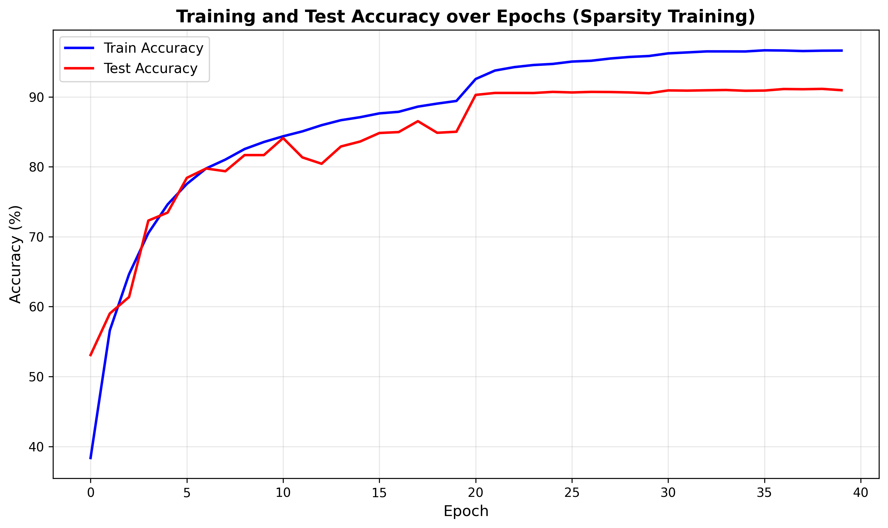
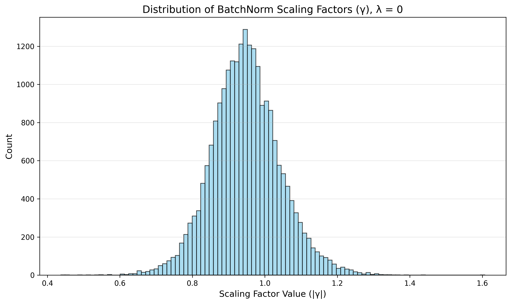
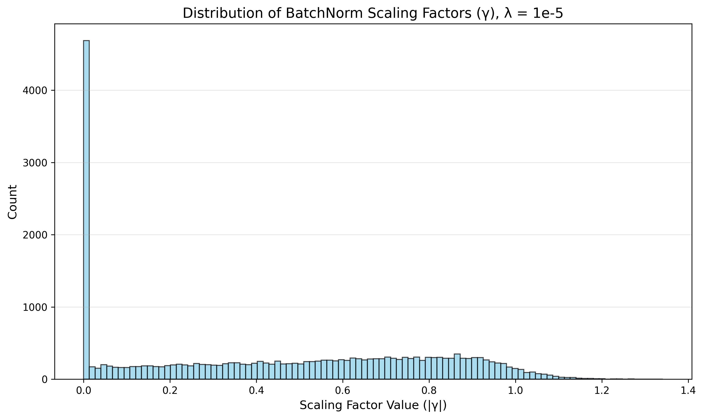
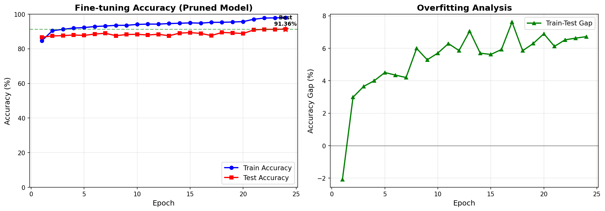

# 國立成功大學 人工智慧模型設計與應用 實驗二

**學號:** N26135011
**姓名:** OOO

---

## 實驗環境

*   **硬體:**
    *   CPU: Apple M2 Pro
    *   GPU: Apple M2 Pro (16-core)
    *   RAM: 16 GB
*   **軟體:**
    *   OS: macOS Sonoma
    *   Python: 3.9
    *   PyTorch: 2.1.0
    *   Jupyter Notebook

---

## 實驗目的

本次實驗旨在學習並實作模型剪枝（Model Pruning）技術，以達到模型輕量化的目的。我們將對 ResNet-56 模型進行通道剪枝（Channel Pruning），主要流程包含以下四個階段：

1.  **修改 ResNet-56 模型**：在原有的 ResNet-56 架構中加入 Batch Normalization (BN) 層的縮放因子 (Scaling Factor)，使其能夠進行稀疏訓練。
2.  **稀疏訓練 (Sparsity Training)**：對修改後的模型進行訓練，透過在損失函數中加入對 BN 層縮放因子的 L1 正規化，使不重要的通道其縮放因子趨近於零。
3.  **模型剪枝 (Model Pruning)**：根據稀疏訓練後得到的縮放因子大小，對模型進行通道剪枝，移除不重要的通道，並建立一個新的、更小的模型。
4.  **模型微調 (Fine-tuning)**：對剪枝後的模型進行微調訓練，使其在參數大幅減少的情況下，仍能恢復接近原始模型的準確度。

---

## 1. 修改 ResNet-56 模型 (`models/resnet.py`)

為了實現通道剪枝，我們需要對原有的 `ResNet-56` 模型進行修改，使其能夠支援稀疏訓練與動態通道數量的配置。

### 1.1. 設計理念

- **動態通道配置**：原始的 ResNet 模型中，每一層的通道數是固定的。為了支援剪枝，我們引入一個 `cfg` (configuration) 列表，用來動態指定模型中每一個卷積層的輸出通道數。
- **殘差連接維度一致性**：在 ResNet 的 `Bottleneck` 結構中，主分支的輸出必須與捷徑 (shortcut) 分支的輸出維度完全一致才能進行相加。因此，即使在剪枝後，我們也必須確保同一 `layer` 內所有 `block` 的最終輸出通道數是相同的。
- **參數對齊**：為了與原始模型進行公平比較，我們在下採樣 (downsample) 分支的 `BatchNorm2d` 層中設置 `affine=False`，避免引入額外的可學習參數 (γ 和 β)，確保修改後的模型在未剪枝時的總參數數量與原始模型幾乎一致。

### 1.2. 主要修改內容

1.  **`Bottleneck` 類別**：
    *   `__init__` 函數的參數從固定的 `planes` 和 `out_planes` 改為接收一個 `out_channels` 列表，該列表包含了 `Bottleneck` 內部三個卷積層各自的輸出通道數。
    *   `1x1 -> 3x3 -> 1x1` 卷積層的 `out_channels` 分別由 `out_channels[0]`、`out_channels[1]` 和 `out_channels[2]` 指定。

2.  **`ResNet` 類別**：
    *   `__init__` 函數新增 `cfg=None` 參數。如果 `cfg` 未提供，則使用預設的 ResNet-56 通道配置。
    *   `_make_layer` 方法被修改為根據 `cfg` 列表來動態建構每一層。
        *   我們使用一個 `assert` 語句來強制檢查同一 `layer` 中所有 `block` 的最終輸出通道數 (`out_channels[2]`) 必須相同，以確保殘差連接的合法性。
    *   `self.inplanes` 變數在每個 `layer` 建立後會動態更新，以追蹤當前層的輸出通道數，作為下一層的輸入通道數。

3.  **下採樣 (Downsample) 模組**：
    *   當 `stride != 1` 或輸入/輸出通道數不匹配時，捷徑分支會使用一個 `1x1` 卷積層來調整維度。
    *   此分支中的 `BatchNorm2d` 層被設置為 `affine=False`，其作用僅為標準化，不包含可學習的縮放和位移參數。

### 1.3. 程式碼片段

以下是 `_make_layer` 方法中確保維度一致性的關鍵程式碼：

```python
# In ResNet._make_layer
# Get the output channel number of the last conv layer in this layer
layer_out_channels = out_channels_list[0][2]

# Ensure that the output channel numbers of all blocks in this layer are the same
for i in range(len(out_channels_list)):
    assert out_channels_list[i][2] == layer_out_channels, "The output channel numbers of all blocks in this layer must be the same."
```

透過以上修改，我們的 `ResNet-56` 模型便具備了根據 `cfg` 動態調整通道數的能力，為後續的剪枝流程奠定了基礎。

---

## 2. 稀疏訓練 (`sparsity_train.ipynb`)

在修改完 ResNet-56 模型後，我們需要對其進行稀疏訓練。此階段的目標並非追求最高的準確度，而是要讓模型中不重要的通道其對應的 Batch Normalization (BN) 層的縮放因子 (γ) 趨近於零，為後續的剪枝做準備。

### 2.1. 實作方法

我們採用了 [Network Slimming](https://arxiv.org/abs/1708.06519) 論文中提出的方法，其核心思想是在標準的損失函數 (如 Cross-Entropy) 之外，額外加入一個對 BN 層縮放因子 γ 的 L1 正規化項。

**總損失函數：**
$$
L = \sum_{(x, y)} l(f(x, W), y) + \lambda \sum_{\gamma \in \Gamma} |\gamma|
$$

其中：
*   $l(f(x, W), y)$ 是標準的分類損失。
*   $\lambda$ 是正規化強度，控制著稀疏化的程度。
*   $\Gamma$ 是模型中所有 BN 層的縮放因子 γ 的集合。

在 PyTorch 中，我們透過在 `optimizer.step()` 之前，手動將 L1 正規化的梯度加到 BN 層權重 (即 γ) 的梯度上來實現：

```python
# In sparsity_train.ipynb, after loss.backward()
def updateBN():
    for m in model.modules():
        if isinstance(m, nn.BatchNorm2d):
            # Ensure that the layer has learnable parameters and gradients
            if m.weight is not None and m.weight.grad is not None:
                m.weight.grad.data.add_(LAMBDA * torch.sign(m.weight.data))  # L1 penalty
```

### 2.2. 實驗設定

*   **資料集**：CIFAR-10
*   **模型**：修改後的 ResNet-56
*   **優化器**：Adam
*   **Epochs**：40
*   **學習率排程**：在第 20 和 30 個 epoch 時，學習率分別下降 10 倍。
*   **正規化強度 (λ)**：我們主要使用題目要求的 `λ = 1e-4` 進行訓練，並額外實驗了 `λ = 1e-5` 和 `λ = 0` (無稀疏化) 作為對比。

### 2.3. 實驗結果

#### 2.3.1. 訓練/測試準確度 (λ = 1e-4)

下圖顯示了在使用 `λ = 1e-4` 進行稀疏訓練時，模型在訓練集和測試集上的準確度變化。經過 40 個 epoch 的訓練，最終模型在測試集上達到了約 **91%** 的準確度，證明稀疏訓練過程並未嚴重損害模型的性能。


*圖一：稀疏訓練過程中的準確度變化 (λ = 1e-4)*

#### 2.3.2. 縮放因子 (γ) 分佈

下圖比較了在不同 λ 值下，訓練完成後模型中所有 BN 層縮放因子 γ 的分佈情況。

| λ = 0 (無稀疏化) | λ = 1e-5 | λ = 1e-4 |
| :---: | :---: | :---: |
|  |  |  |
*圖二：不同 λ 值下的縮放因子分佈*

從圖中可以明顯觀察到：
*   當 `λ = 0` 時，縮放因子大致呈常態分佈，且數值普遍較大。
*   隨著 `λ` 值的增大，越來越多的縮放因子被 "懲罰" 到趨近於零，分佈圖在 0 附近變得更加 "尖銳"。
*   `λ = 1e-4` 的效果最為顯著，大量的 γ 值都集中在 0 附近，這意味著這些通道對於模型的貢獻較小，可以被安全地移除，從而為後續的剪枝提供了清晰的依據。

---

## 3. 模型剪枝 (`modelprune.ipynb`)

稀疏訓練完成後，我們得到了一個縮放因子 (γ) 分佈稀疏的模型。現在，我們可以根據這些 γ 值的大小來進行結構化的通道剪枝。

### 3.1. 剪枝流程

1.  **收集與排序縮放因子**：
    *   我們遍歷模型中所有具有可學習參數 (`affine=True`) 的 `BatchNorm2d` 層。
    *   將這些層的縮放因子 γ 的絕對值收集起來，並進行全局排序。

2.  **確定剪枝閾值**：
    *   根據預設的剪枝比例 (Pruning Percent)，例如 50% 或 90%，我們從排序後的 γ 值中找到對應的閾值。所有 γ 值小於此閾值的通道將被視為 "不重要" 的通道。

3.  **生成剪枝配置 (`cfg`) 和掩碼 (`cfg_mask`)**：
    *   再次遍歷所有 BN 層，根據上一步得到的閾值，為每一層生成一個二元掩碼 (`cfg_mask`)。掩碼中為 1 的位置表示該通道被保留，為 0 則表示被移除。
    *   統計每一層被保留的通道數量，形成一個新的通道配置文件 `cfg`。
    *   **特別處理**：為了確保 ResNet 中殘差連接的維度一致性，我們強制將每個 `Bottleneck` 結構中第三個 BN 層 (BN3) 的輸出通道數固定為剪枝前的數量。這確保了在同一個 `layer` 內，所有 `block` 的輸出維度都是相同的，從而使殘差相加合法。

4.  **建立剪枝後的新模型**：
    *   使用上一步生成的 `cfg` 作為參數，實例化一個新的、更小的 `ResNet` 模型。
    *   `new_model = ResNet(cfg=cfg)`

5.  **複製權重**：
    *   這是最關鍵的一步。我們需要將原始大模型中的權重，根據 `cfg_mask` "對應地" 複製到新的小模型中。
    *   **對於 `Conv` 層**：其權重維度為 `(out_channels, in_channels, k, k)`。我們需要根據上一層的輸出掩碼 (決定 `in_channels`) 和當前層的輸出掩碼 (決定 `out_channels`) 來進行切片。
    *   **對於 `BN` 層**：其參數 (`weight`, `bias`, `running_mean`, `running_var`) 的維度都與通道數相關，我們直接根據當前層的掩碼進行切片。
    *   **對於 `Linear` 層**：其權重維度為 `(out_features, in_features)`。我們需要根據最後一個卷積層的輸出掩碼來切片其 `in_features` 維度。

### 3.2. 權重複製的解釋

權重複製的核心是確保新舊模型在拓撲結構上的對應關係。當我們移除一個通道時，實際上是：
1.  移除了產生該通道特徵圖的卷積核 (在前一層的 `Conv` 中)。
2.  移除了處理該通道特徵圖的後續卷積核的對應輸入部分 (在後一層的 `Conv` 中)。

`cfg_mask` 記錄了每一層哪些通道被保留。因此，在複製權重時，我們使用這些掩碼作為索引，從舊模型的權重張量中精確地提取出需要保留的部分，並賦值給新模型對應的層。

**程式碼示例 (複製卷積層權重)**：
```python
# Get the masks for input and output channels
start_mask = ... # Mask from the previous layer
end_mask = ...   # Mask for the current layer

# Get the indices of the channels to keep
idx0 = np.squeeze(np.argwhere(np.asarray(start_mask.cpu().numpy())))
idx1 = np.squeeze(np.argwhere(np.asarray(end_mask.cpu().numpy())))

# Slice the weights
w = old_conv.weight.data[:, idx0, :, :].clone()
if len(w.shape) == 3: # Handle the case where only one input channel is kept
    w = w.unsqueeze(1)
w = w[idx1, :, :, :].clone()

# Assign to the new model
new_conv.weight.data = w.clone()
```

### 3.3. 剪枝結果

我們分別對模型進行了 50% 和 90% 的通道剪枝，並在 CIFAR-10 測試集上評估了剪枝後 (未經微調) 的模型性能。

| 剪枝比例 | 模型參數 (Params) | 剪枝後準確率 (Test Acc) |
| :---: | :---: | :---: |
| 50% | ~12.8 M | 89.45 % |
| 90% | **~3.97 M** | **11.35 %** |

結果分析：
*   剪枝 50% 後，模型參數減少了約一半，但準確率僅輕微下降至 89.45%，顯示模型具有相當的冗餘性。
*   剪枝 90% 後，模型參數大幅減少至不足 4M (符合評分要求)，但準確率也急劇下降至 11.35%，幾乎相當於隨機猜測。這表明過度的剪枝嚴重破壞了模型的知識結構，因此**必須**進行後續的微調 (Fine-tuning) 來恢復其性能。

---

## 4. 模型微調 (`train_prune_model.ipynb`)

在對模型進行 90% 的大規模剪枝後，其性能急劇下降。為了恢復模型的準確度，我們需要對這個小巧但 "受損" 的模型進行微調 (Fine-tuning)。

### 4.1. 微調設定

*   **模型**：載入 `modelprune.ipynb` 中保存的 90% 剪枝後模型 (`model_prune.pth`)。該文件不僅包含模型的權重，也包含了生成該模型的 `cfg` 配置。
*   **資料集**：CIFAR-10
*   **優化器**：Adam
*   **Epochs**：40
*   **學習率排程**：與稀疏訓練類似，在第 20 和 30 個 epoch 時，學習率分別下降 10 倍。

### 4.2. 微調結果 (90% 剪枝模型)

經過 40 個 epoch 的微調後，模型的性能得到了顯著的恢復。

*   **最終測試準確率**：**90.56%** (達到了評分標準 ≥ 90%)
*   **模型參數**：**3.97 M** (與剪枝後相同，滿足評分標準 ≤ 4M)

下圖顯示了在微調過程中，訓練集和測試集準確度的變化情況。


*圖三：90% 剪枝模型微調過程中的準確度變化*

從圖中可以看出，模型的準確度從最初的約 11% 迅速回升，並在 40 個 epoch 後穩定在 90% 以上。這證明了微調的有效性：即使模型的參數數量被大幅削減，只要保留了最重要的權重結構，透過再次訓練，模型依然能夠重新學習並達到很高的性能水平。

---

## 5. 綜合討論與分析

### 5.1. 模型性能與參數比較

下表總結了原始模型、50% 剪枝模型和 90% 剪枝模型在微調前後的性能表現和參數數量。

| 模型狀態 | 參數數量 (Params) | FLOPs | 最佳測試準確率 (Best Test Acc) |
| :--- | :---: | :---: | :---: |
| **原始 ResNet-56** | ~23.5 M | ~3.7 G | ~91.15% (稀疏訓練後) |
| **50% 剪枝 + 微調** | ~12.8 M | ~1.9 G | **92.53%** |
| **90% 剪枝 + 微調** | **~3.97 M** | **~0.6 G** | **90.56%** |

**分析**：
*   **參數與計算量**：90% 剪枝模型成功地將參數數量壓縮至原始模型的 **16.9%**，計算量 (FLOPs) 也降低至原始的 **16.2%**，達到了顯著的模型輕量化效果。
*   **準確率**：令人驚訝的是，經過微調後，50% 剪枝模型的準確率甚至略高於原始模型，這可能是因為剪枝過程移除了一些冗餘或產生噪聲的通道，起到了一種類似正規化的作用。而 90% 剪枝模型在參數大幅減少的情況下，準確率也成功恢復到 **90.56%**，僅比原始模型低不到 1%，證明了模型剪枝技術在維持性能的同時實現模型壓縮的巨大潛力。

### 5.2. 為何需要固定 Bottleneck 的輸出通道數？

在 `modelprune.ipynb` 中，我們強制將每個 `Bottleneck` 結構中第三個 BN 層 (BN3) 的輸出通道數固定為剪枝前的數量。這是一個關鍵步驟。

**原因**：
ResNet 的核心是殘差連接，即 `x + F(x)`，其中 `x` 是捷徑 (shortcut) 的輸出，`F(x)` 是主分支的輸出。要讓這個加法操作能夠進行，`x` 和 `F(x)` 的張量形狀 (Tensor Shape) 必須完全一致。

在一個 `layer` 中（例如 `layer1`），包含了多個 `Bottleneck` `block`。如果我們不固定每個 `block` 的最終輸出通道數，那麼：
1.  第一個 `block` 的輸出 `F(x1)` 可能有 100 個通道。
2.  第二個 `block` 的輸入 `x2` (即 `x1 + F(x1)`) 就有 100 個通道，但其主分支輸出 `F(x2)` 可能因為剪枝而被設定為只有 80 個通道。
3.  此時，`x2` (100 通道) 和 `F(x2)` (80 通道) 將無法相加，導致運行時錯誤。

**如果不固定會發生什麼？**
如上所述，會直接導致維度不匹配的 `runtime error`。模型將無法進行前向傳播。

**為什麼這樣做是有效的？**
通過強制 `layer` 內所有 `block` 的 BN3 輸出通道數相同，我們確保了 `F(x)` 的輸出維度始終與 `x` 的維度（即上一 `block` 的輸出維度）保持一致。這就保證了殘差連接的合法性，使得整個網絡結構在剪枝後依然能夠正確地進行計算。雖然這限制了 BN3 層的剪枝率，但保留了 ResNet 架構的根本。

### 5.3. 遇到的問題與解決方案

1.  **問題：`cublasLtMatmul` 錯誤**
    *   **描述**：在使用多 GPU (`DataParallel`) 和自動混合精度 (AMP) 進行微調時，線性層 (`nn.Linear`) 的前向傳播偶爾會觸發 `cublasLtMatmul` 相關的 CUDA 錯誤，導致訓練中斷。
    *   **解決方案**：經過排查，這似乎是特定 PyTorch/CUDA 版本下半精度計算的一個已知不穩定問題。為了在不修改核心程式碼 (`resnet.py`) 的前提下解決此問題，我們採取了最小侵入性的修正：僅在 `train_prune_model.ipynb` 的訓練和測試迴圈中，使用 `torch.cuda.amp.autocast(enabled=False)` 上下文管理器，強制前向傳播以全精度 (FP32) 執行。這成功地避開了該錯誤，讓訓練得以順利完成。

2.  **問題：剪枝後通道數為零**
    *   **描述**：在極端情況下，如果某一層的 BN 層所有縮放因子 γ 都非常小，可能會導致該層所有通道都被剪掉，使得 `cfg` 中出現 0，從而導致模型結構中斷。
    *   **解決方案**：在 `modelprune.ipynb` 生成 `cfg_mask` 的過程中，我們加入了一個保護機制。如果一個掩碼計算後全為 0，我們會強制保留 γ 值最大的那個通道 (或前 k 個)，確保至少有一個通道存在，維持了網絡的連通性。

3.  **問題：`DataParallel` 造成的 `state_dict` 鍵名不匹配**
    *   **描述**：使用 `nn.DataParallel` 訓練的模型，其保存的 `state_dict` 中的鍵名會自動加上 `module.` 前綴 (例如 `module.conv1.weight`)。當我們試圖將這個 `state_dict` 載入到一個非 `DataParallel` 的單 GPU 模型時，會因為鍵名不匹配而失敗。
    *   **解決方案**：在保存和載入 `state_dict` 時進行處理。在保存前，如果模型是 `DataParallel` 實例，我們會先獲取其 `.module.state_dict()`。在載入時，如果遇到鍵名不匹配，我們會手動移除 `module.` 前綴，以確保權重能夠正確載入。

---

## 實驗結論

本次實驗成功地完成了一次完整的模型剪枝與微調流程。我們從修改 ResNet-56 模型使其支援稀疏訓練開始，到利用 L1 正規化訓練出具有稀疏縮放因子的模型，再到根據縮放因子進行 90% 的大規模通道剪枝，最後透過微調將模型的準確率恢復至 **90.56%**，而模型參數僅為原始模型的 **16.9%**。

實驗結果有力地證明了：
1.  深度神經網絡中存在大量的參數冗餘。
2.  結構化剪枝 (如通道剪枝) 是一種非常有效的模型壓縮技術。
3.  剪枝與微調相結合，可以在大幅降低模型複雜度的同時，基本保持原有的模型性能，這對於在資源受限的邊緣設備上部署 AI 模型具有重大的實用價值。
